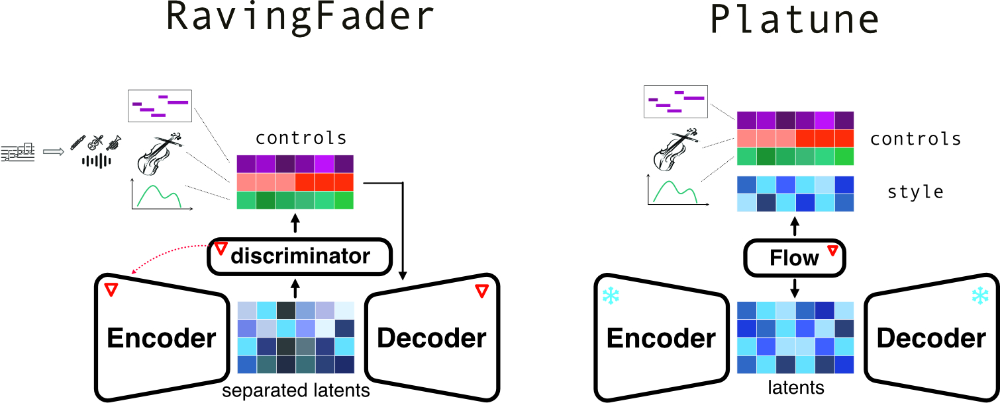
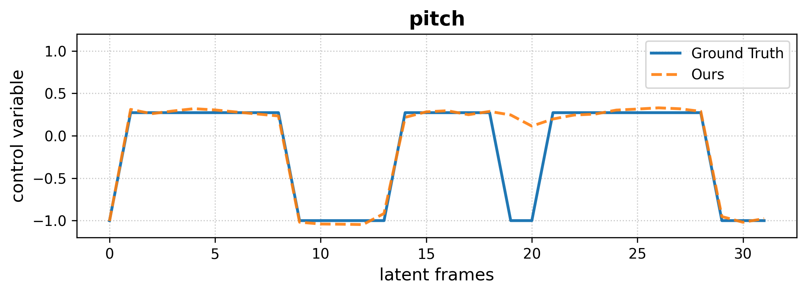
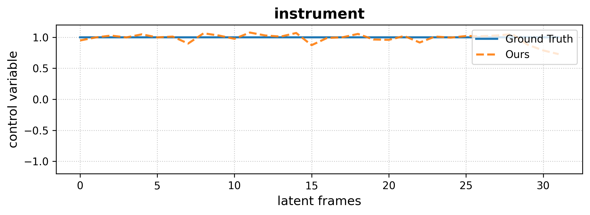

<!-- # Supervised separation of explicit and implicit controls -->

 
  <h1>Supervised separation of explicit and implicit controls</h1>
  Code for Raving Fader <a href="https://github.com/neurorave/neurorave/tree/maintree/main">here</a>.  
  Code for Platune <a href="https://github.com/acids-ircam/platune/">here</a>.

 
  

## Audio editing with Platune

### Medley Solos
We present results of our Platune model on the [MedleySolos](https://adasp.telecom-paris.fr/resources/2018-09-28-medley-solos-db/) dataset. The task consists of editing either the instrument of melody of a given audio.  

Scroll to see all the results if necessary.

<table class="table table-sm text-center" style="vertical-align: middle; min-width: 1200px;">
  <colgroup>
    <col style="width: 50px;">
    <col style="width: 200px;">
    <col style="width: 200px;">
    <col style="width: 100px;">
    <col style="width: 200px;">
    <col style="width: 600px;">
  </colgroup>
  <thead>
    <tr>
      <th style="text-align:center;"></th>
      <th style="text-align:center;">Source</th>
      <th style="text-align:center;">Target</th>
      <th style="text-align:center;">Type</th>
      <th style="text-align:center;">Platune</th>
      <th style="text-align:center;">Target Features inference</th>
    </tr>
  </thead>
  <tbody>

  <tr>
    <td rowspan="2">1</td>
    <td rowspan="2"><audio src="assets/samples/chapter4/results/medley_solos/edit/83_560/source_83_female singer.wav" controls style="width: 200px"></audio></td>
    <td rowspan="2"><audio src="assets/samples/chapter4/results/medley_solos/edit/83_560/target_560_violin.wav" controls style="width: 200px"></audio></td>
    <td>instrument</td>
    <td><audio src="assets/samples/chapter4/results/medley_solos/edit/83_560/83_560_edit_inst_female singer_violin_ours.wav" controls style="width: 200px"></audio></td>
    <td></td>
  </tr>
  <tr>
    <td>melody</td>
    <td><audio src="assets/samples/chapter4/results/medley_solos/edit/83_560/83_560_edit_mel_ours.wav" controls style="width: 200px"></audio></td>
    <td></td>
  </tr>

  <tr>
    <td rowspan="2">2</td>
    <td rowspan="2"><audio src="assets/samples/chapter4/results/medley_solos/edit/174_50/source_174_flute.wav" controls style="width: 200px"></audio></td>
    <td rowspan="2"><audio src="assets/samples/chapter4/results/medley_solos/edit/174_50/target_50_violin.wav" controls style="width: 200px"></audio></td>
    <td>instrument</td>
    <td><audio src="assets/samples/chapter4/results/medley_solos/edit/174_50/174_50_edit_inst_flute_violin_ours.wav" controls style="width: 200px"></audio></td>
    <td></td>
  </tr>
  <tr>
    <td>melody</td>
    <td><audio src="assets/samples/chapter4/results/medley_solos/edit/174_50/174_50_edit_mel_ours.wav" controls style="width: 200px"></audio></td>
    <td></td>
  </tr>

  <tr>
    <td rowspan="2">3</td>
    <td rowspan="2"><audio src="assets/samples/chapter4/results/medley_solos/edit/202_652/source_202_violin.wav" controls style="width: 200px"></audio></td>
    <td rowspan="2"><audio src="assets/samples/chapter4/results/medley_solos/edit/202_652/target_652_trumpet.wav" controls style="width: 200px"></audio></td>
    <td>instrument</td>
    <td><audio src="assets/samples/chapter4/results/medley_solos/edit/202_652/202_652_edit_inst_violin_trumpet_ours.wav" controls style="width: 200px"></audio></td>
    <td></td>
  </tr>
  <tr>
    <td>melody</td>
    <td><audio src="assets/samples/chapter4/results/medley_solos/edit/202_652/202_652_edit_mel_ours.wav" controls style="width: 200px"></audio></td>
    <td></td>
  </tr>

  <!-- Repeat for examples 4, 5, 6 ... -->
  </tbody>
</table>

### Piano recordings

Below we provide qualitative results from our model on the <b>Maestro Piano</b> dataset.  
For each example, we display:

<ul>
  <li><b>Original</b>: decoded from the base latent representation.</li>
  <li><b>Reconstruction</b>: using both control and style variables.</li>
  <li><b>Style Variation</b>: resampling only the style vector, keeping controls fixed.</li>
  <li><b>Descriptor Edits</b>: systematic decrease (<i>–1</i>) and increase (<i>+1</i>) of each control descriptor, while clamped to the valid range.</li>
</ul>

---

<table class="table table-sm text-center" style="vertical-align: middle; width: 100%;">
  <thead>
    <tr>
      <th style="text-align:center; width: 200px;">Original</th>
      <th style="text-align:center; width: 200px;">Reconstruction</th>
      <th style="text-align:center; width: 200px;">Style Variation</th>
      <th style="text-align:center; width: 400px;">Descriptor Edits</th>
    </tr>
  </thead>
  <tbody>

  <!-- Example 1 --> 
  <tr>
    <!-- Original -->
    <td>
      <audio src="assets/samples/chapter4/results_maestro/example_1960/original.wav" controls style="width: 180px"></audio>
    </td>
    <!-- Reconstruction -->
    <td>
      <audio src="assets/samples/chapter4/results_maestro/example_1960/reconstruction.wav" controls style="width: 180px"></audio>
    </td>
    <!-- Style Variation -->
    <td>
      <audio src="assets/samples/chapter4/results_maestro/example_1960/variation.wav" controls style="width: 180px"></audio>
    </td>
    <!-- Descriptor Edits -->
    <td>
      
<b>Average Duration</b>

      <audio src="assets/samples/chapter4/results_maestro/example_1960/average_duration_low.wav" controls style="width: 180px"></audio>
      <audio src="assets/samples/chapter4/results_maestro/example_1960/average_duration_high.wav" controls style="width: 180px"></audio>
      
<b>Note Density</b>

      <audio src="assets/samples/chapter4/results_maestro/example_1960/note_density_low.wav" controls style="width: 180px"></audio>
      <audio src="assets/samples/chapter4/results_maestro/example_1960/note_density_high.wav" controls style="width: 180px"></audio>
      
<b>Central Pitch</b>

      <audio src="assets/samples/chapter4/results_maestro/example_1960/central_pitch_low.wav" controls style="width: 180px"></audio>
      <audio src="assets/samples/chapter4/results_maestro/example_1960/central_pitch_high.wav" controls style="width: 180px"></audio>
      
<b>Pitch Range Var.</b>

      <audio src="assets/samples/chapter4/results_maestro/example_1960/pitch_range_var_low.wav" controls style="width: 180px"></audio>
      <audio src="assets/samples/chapter4/results_maestro/example_1960/pitch_range_var_high.wav" controls style="width: 180px"></audio>
    </td>
  </tr>

  <!-- Example 2 -->
  <tr>
    <td>
      <audio src="assets/samples/chapter4/results_maestro/example_7606/original.wav" controls style="width: 180px"></audio>
    </td>
    <td>
      <audio src="assets/samples/chapter4/results_maestro/example_7606/reconstruction.wav" controls style="width: 180px"></audio>
    </td>
    <td>
      <audio src="assets/samples/chapter4/results_maestro/example_7606/variation.wav" controls style="width: 180px"></audio>
    </td>
    <td>
      
<b>Average Duration</b>

      <audio src="assets/samples/chapter4/results_maestro/example_7606/average_duration_low.wav" controls style="width: 180px"></audio>
      <audio src="assets/samples/chapter4/results_maestro/example_7606/average_duration_high.wav" controls style="width: 180px"></audio>
      
<b>Note Density</b>

      <audio src="assets/samples/chapter4/results_maestro/example_7606/note_density_low.wav" controls style="width: 180px"></audio>
      <audio src="assets/samples/chapter4/results_maestro/example_7606/note_density_high.wav" controls style="width: 180px"></audio>
      
<b>Central Pitch</b>

      <audio src="assets/samples/chapter4/results_maestro/example_7606/central_pitch_low.wav" controls style="width: 180px"></audio>
      <audio src="assets/samples/chapter4/results_maestro/example_7606/central_pitch_high.wav" controls style="width: 180px"></audio>
      
<b>Pitch Range Var.</b>

      <audio src="assets/samples/chapter4/results_maestro/example_7606/pitch_range_var_low.wav" controls style="width: 180px"></audio>
      <audio src="assets/samples/chapter4/results_maestro/example_7606/pitch_range_var_high.wav" controls style="width: 180px"></audio>
    </td>
  </tr>

<tr>
    <td>
      <audio src="assets/samples/chapter4/results_maestro/example_577/original.wav" controls style="width: 180px"></audio>
    </td>
    <td>
      <audio src="assets/samples/chapter4/results_maestro/example_577/reconstruction.wav" controls style="width: 180px"></audio>
    </td>
    <td>
      <audio src="assets/samples/chapter4/results_maestro/example_577/variation.wav" controls style="width: 180px"></audio>
    </td>
    <td>
      
<b>Average Duration</b>

      <audio src="assets/samples/chapter4/results_maestro/example_577/average_duration_low.wav" controls style="width: 180px"></audio>
      <audio src="assets/samples/chapter4/results_maestro/example_577/average_duration_high.wav" controls style="width: 180px"></audio>
      
<b>Note Density</b>

      <audio src="assets/samples/chapter4/results_maestro/example_577/note_density_low.wav" controls style="width: 180px"></audio>
      <audio src="assets/samples/chapter4/results_maestro/example_577/note_density_high.wav" controls style="width: 180px"></audio>
      
<b>Central Pitch</b>

      <audio src="assets/samples/chapter4/results_maestro/example_577/central_pitch_low.wav" controls style="width: 180px"></audio>
      <audio src="assets/samples/chapter4/results_maestro/example_577/central_pitch_high.wav" controls style="width: 180px"></audio>
      
<b>Pitch Range Var.</b>

      <audio src="assets/samples/chapter4/results_maestro/example_577/pitch_range_var_low.wav" controls style="width: 180px"></audio>
      <audio src="assets/samples/chapter4/results_maestro/example_577/pitch_range_var_high.wav" controls style="width: 180px"></audio>
    </td>
  </tr>

<!-- Example 4 -->
  <tr>
    <td>
      <audio src="assets/samples/chapter4/results_maestro/example_9683/original.wav" controls style="width: 180px"></audio>
    </td>
    <td>
      <audio src="assets/samples/chapter4/results_maestro/example_9683/reconstruction.wav" controls style="width: 180px"></audio>
    </td>
    <td>
      <audio src="assets/samples/chapter4/results_maestro/example_9683/variation.wav" controls style="width: 180px"></audio>
    </td>
    <td>
      
<b>Average Duration</b>

      <audio src="assets/samples/chapter4/results_maestro/example_9683/average_duration_low.wav" controls style="width: 180px"></audio>
      <audio src="assets/samples/chapter4/results_maestro/example_9683/average_duration_high.wav" controls style="width: 180px"></audio>
      
<b>Note Density</b>

      <audio src="assets/samples/chapter4/results_maestro/example_9683/note_density_low.wav" controls style="width: 180px"></audio>
      <audio src="assets/samples/chapter4/results_maestro/example_9683/note_density_high.wav" controls style="width: 180px"></audio>
      
<b>Central Pitch</b>

      <audio src="assets/samples/chapter4/results_maestro/example_9683/central_pitch_low.wav" controls style="width: 180px"></audio>
      <audio src="assets/samples/chapter4/results_maestro/example_9683/central_pitch_high.wav" controls style="width: 180px"></audio>
      
<b>Pitch Range Var.</b>

      <audio src="assets/samples/chapter4/results_maestro/example_9683/pitch_range_var_low.wav" controls style="width: 180px"></audio>
      <audio src="assets/samples/chapter4/results_maestro/example_9683/pitch_range_var_high.wav" controls style="width: 180px"></audio>
    </td>
  </tr>

<!-- Example 2 -->
  <tr>
    <td>
      <audio src="assets/samples/chapter4/results_maestro/example_10359/original.wav" controls style="width: 180px"></audio>
    </td>
    <td>
      <audio src="assets/samples/chapter4/results_maestro/example_10359/reconstruction.wav" controls style="width: 180px"></audio>
    </td>
    <td>
      <audio src="assets/samples/chapter4/results_maestro/example_10359/variation.wav" controls style="width: 180px"></audio>
    </td>
    <td>
      
<b>Average Duration</b>

      <audio src="assets/samples/chapter4/results_maestro/example_10359/average_duration_low.wav" controls style="width: 180px"></audio>
      <audio src="assets/samples/chapter4/results_maestro/example_10359/average_duration_high.wav" controls style="width: 180px"></audio>
      
<b>Note Density</b>

      <audio src="assets/samples/chapter4/results_maestro/example_10359/note_density_low.wav" controls style="width: 180px"></audio>
      <audio src="assets/samples/chapter4/results_maestro/example_10359/note_density_high.wav" controls style="width: 180px"></audio>
      
<b>Central Pitch</b>

      <audio src="assets/samples/chapter4/results_maestro/example_10359/central_pitch_low.wav" controls style="width: 180px"></audio>
      <audio src="assets/samples/chapter4/results_maestro/example_10359/central_pitch_high.wav" controls style="width: 180px"></audio>
      
<b>Pitch Range Var.</b>

      <audio src="assets/samples/chapter4/results_maestro/example_10359/pitch_range_var_low.wav" controls style="width: 180px"></audio>
      <audio src="assets/samples/chapter4/results_maestro/example_10359/pitch_range_var_high.wav" controls style="width: 180px"></audio>
    </td>
  </tr>

  </tbody>
</table>

## Comparison between Raving Fader and Platune 

Below we provide side-by-side comparisons for Platune and Raving Fader models on Medley solos. Models are conditionned only on pitch and loudness. 
For each model, we display:

<ul>
  <li><b>Reconstruction</b> of Audio 1</li>
  <li><b>Style Variations</b> Variation of style with controls from Audio 1</li>
  <li><b>Transfer</b>: pitch and style from Audio 1, loudness from Audio 2.</li>
</ul>

---

<table class="table table-sm text-center" style="vertical-align: middle; width: 100%;">
  <thead>
    <tr>
      <th style="text-align:center; width: 200px;">Audio 1</th>
      <th style="text-align:center; width: 200px;">Audio 2</th>
      <th style="text-align:center; width: 300px;">Raving Fader</th>
      <th style="text-align:center; width: 300px;">Platune</th>
    </tr>
  </thead>
  <tbody>

  <!-- Example 2 -->
  <tr>
    <td>
      <audio src="assets/samples/chapter4/example1/source1.wav" controls style="width: 200px"></audio>
    </td>
    <td>
      <audio src="assets/samples/chapter4/example1/source2.wav" controls style="width: 200px"></audio>
    </td>

<td>
      
<b>Reconstruction</b>

      <audio src="assets/samples/chapter4/example1/fader_pl_rec.wav" controls style="width: 200px"></audio>
      
<b>Style Variations</b>

      <audio src="assets/samples/chapter4/example1/fader_pl_sample1.wav" controls style="width: 200px"></audio>
      <audio src="assets/samples/chapter4/example1/fader_pl_sample2.wav" controls style="width: 200px"></audio>
      <audio src="assets/samples/chapter4/example1/fader_pl_sample3.wav" controls style="width: 200px"></audio>
      
<b>Pitch A – Loudness B</b>

      <audio src="assets/samples/chapter4/example1/fader_pl_transfer.wav" controls style="width: 200px"></audio>
    </td>

<td>
      
<b>Reconstruction</b>

      <audio src="assets/samples/chapter4/example1/platune_pl_rec.wav" controls style="width: 200px"></audio>
      
<b>Style Variations</b>

      <audio src="assets/samples/chapter4/example1/platune_pl_sample1.wav" controls style="width: 200px"></audio>
      <audio src="assets/samples/chapter4/example1/platune_pl_sample2.wav" controls style="width: 200px"></audio>
      <audio src="assets/samples/chapter4/example1/platune_pl_sample3.wav" controls style="width: 200px"></audio>
      
<b>Pitch A – Loudness B</b>

      <audio src="assets/samples/chapter4/example1/platune_pl_transfer.wav" controls style="width: 200px"></audio>
    </td>
  </tr>

<tr>
    <td>
      <audio src="assets/samples/chapter4/example4/source1.wav" controls style="width: 200px"></audio>
    </td>
    <td>
      <audio src="assets/samples/chapter4/example4/source2.wav" controls style="width: 200px"></audio>
    </td>

<td>
      
<b>Reconstruction</b>

      <audio src="assets/samples/chapter4/example4/fader_pl_rec.wav" controls style="width: 200px"></audio>
      
<b>Style Variations</b>

      <audio src="assets/samples/chapter4/example4/fader_pl_sample1.wav" controls style="width: 200px"></audio>
      <audio src="assets/samples/chapter4/example4/fader_pl_sample2.wav" controls style="width: 200px"></audio>
      <audio src="assets/samples/chapter4/example4/fader_pl_sample3.wav" controls style="width: 200px"></audio>
      
<b>Pitch A – Loudness B</b>

      <audio src="assets/samples/chapter4/example4/fader_pl_transfer.wav" controls style="width: 200px"></audio>
    </td>

<td>
      
<b>Reconstruction</b>

      <audio src="assets/samples/chapter4/example4/platune_pl_rec.wav" controls style="width: 200px"></audio>
      
<b>Style Variations</b>

      <audio src="assets/samples/chapter4/example4/platune_pl_sample1.wav" controls style="width: 200px"></audio>
      <audio src="assets/samples/chapter4/example4/platune_pl_sample2.wav" controls style="width: 200px"></audio>
      <audio src="assets/samples/chapter4/example4/platune_pl_sample3.wav" controls style="width: 200px"></audio>
      
<b>Pitch A – Loudness B</b>

      <audio src="assets/samples/chapter4/example4/platune_pl_transfer.wav" controls style="width: 200px"></audio>
    </td>
  </tr>

<tr>
    <td>
      <audio src="assets/samples/chapter4/example14/source1.wav" controls style="width: 200px"></audio>
    </td>
    <td>
      <audio src="assets/samples/chapter4/example14/source2.wav" controls style="width: 200px"></audio>
    </td>

<td>
      
<b>Reconstruction</b>

      <audio src="assets/samples/chapter4/example14/fader_pl_rec.wav" controls style="width: 200px"></audio>
      
<b>Style Variations</b>

      <audio src="assets/samples/chapter4/example14/fader_pl_sample1.wav" controls style="width: 200px"></audio>
      <audio src="assets/samples/chapter4/example14/fader_pl_sample2.wav" controls style="width: 200px"></audio>
      <audio src="assets/samples/chapter4/example14/fader_pl_sample3.wav" controls style="width: 200px"></audio>
      
<b>Pitch A – Loudness B</b>

      <audio src="assets/samples/chapter4/example14/fader_pl_transfer.wav" controls style="width: 200px"></audio>
    </td>

<td>
      
<b>Reconstruction</b>

      <audio src="assets/samples/chapter4/example14/platune_pl_rec.wav" controls style="width: 200px"></audio>
      
<b>Style Variations</b>

      <audio src="assets/samples/chapter4/example14/platune_pl_sample1.wav" controls style="width: 200px"></audio>
      <audio src="assets/samples/chapter4/example14/platune_pl_sample2.wav" controls style="width: 200px"></audio>
      <audio src="assets/samples/chapter4/example14/platune_pl_sample3.wav" controls style="width: 200px"></audio>
      
<b>Pitch A – Loudness B</b>

      <audio src="assets/samples/chapter4/example14/platune_pl_transfer.wav" controls style="width: 200px"></audio>
    </td>
  </tr>

<tr>
    <td>
      <audio src="assets/samples/chapter4/example20/source1.wav" controls style="width: 200px"></audio>
    </td>
    <td>
      <audio src="assets/samples/chapter4/example20/source2.wav" controls style="width: 200px"></audio>
    </td>

<td>
      
<b>Reconstruction</b>

      <audio src="assets/samples/chapter4/example20/fader_pl_rec.wav" controls style="width: 200px"></audio>
      
<b>Style Variations</b>

      <audio src="assets/samples/chapter4/example20/fader_pl_sample1.wav" controls style="width: 200px"></audio>
      <audio src="assets/samples/chapter4/example20/fader_pl_sample2.wav" controls style="width: 200px"></audio>
      <audio src="assets/samples/chapter4/example20/fader_pl_sample3.wav" controls style="width: 200px"></audio>
      
<b>Pitch A – Loudness B</b>

      <audio src="assets/samples/chapter4/example20/fader_pl_transfer.wav" controls style="width: 200px"></audio>
    </td>

<td>
      
<b>Reconstruction</b>

      <audio src="assets/samples/chapter4/example20/platune_pl_rec.wav" controls style="width: 200px"></audio>
      
<b>Style Variations</b>

      <audio src="assets/samples/chapter4/example20/platune_pl_sample1.wav" controls style="width: 200px"></audio>
      <audio src="assets/samples/chapter4/example20/platune_pl_sample2.wav" controls style="width: 200px"></audio>
      <audio src="assets/samples/chapter4/example20/platune_pl_sample3.wav" controls style="width: 200px"></audio>
      
<b>Pitch A – Loudness B</b>

      <audio src="assets/samples/chapter4/example20/platune_pl_transfer.wav" controls style="width: 200px"></audio>
    </td>
  </tr>
  <!-- Repeat more examples... -->

  </tbody>
</table>
